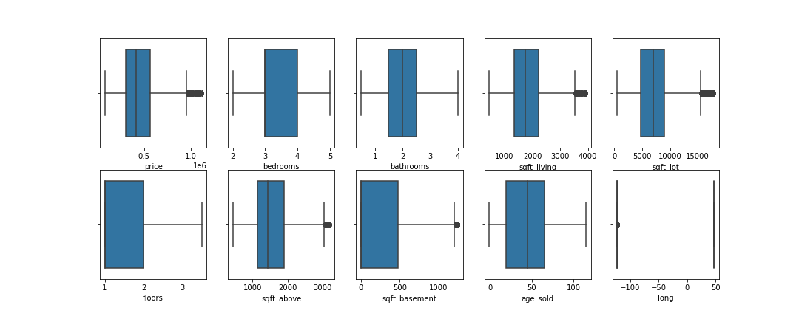
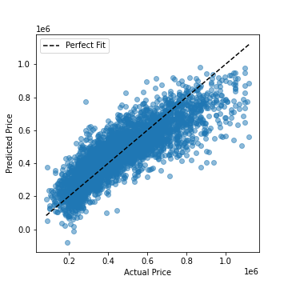
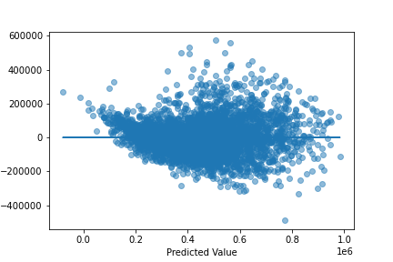

# Phase 2 Project: KING'S COUNTY HOUSING PROJECT

**Author**: [Fred Mutuma](mailto:fred.mutuma@school.moringaschool.com)

All that remains in Phase 2 is to put our newfound data science skills to use with a large project! This project should take 20 to 30 hours to complete.

## Project Overview

For this project, you will use regression modeling to analyze house sales in a northwestern county.

### The Data

This project uses the King County House Sales dataset, which can be found in  `kc_house_data.csv` in the data folder in this repo. The description of the column names can be found in `column_names.md` in the same folder. As with most real world data sets, the column names are not perfectly described, so you'll have to do some research or use your best judgment if you have questions about what the data means.

### Business Problem

I have had the King's County house selling records for the last few years. With the data, I want to build a model in which I can use the features in the data about the house to predict the price. In this case, I can guide both the seller and buyer to their business. The seller can use the model to predict the selling price of their house and if they need to do any renovation before selling their home.

The buyer can have some suggestions about which kind of house they can afford based on their budget.

The objectives set to achieve the final goal:：

Analyse and polish the data which have no meaning or is null to the price.
Remove the features which do not contribute to the house price.
Check if there are some high correlated features in which some of them can be removed.
Build the linear regression model.
Check how the features can contribute to the house change.

## Loading the Data
In the cell below, I load the house data into a dataframe and checked it's dimension and datatype.

df = pd.read_csv("data/kc_house_data.csv")
df.head()

I need to steply remove and polish most of the columns which is not contribute to the price of house
1. Drop all columns that are unnecessary for the project.
2. Split month and year in the date column into two different columns.
3. Replace all null values with int 0.
4. Convert year built column with the property's age.
5. Change column sqft_basement datatype into float.
6. Convert the yr_renovated to number of times renovated in the last 30 years.
7. Trim the zipcode to 4 digits.

## remove the outlier data 
 I then drawed the distribution of each of the columns which had more than 10 unique value to check if there is any outlier values. There are multipal columns contain some outlier data. I then collected all the columns and remove them 
 
 
 
 After remove the unnecessary data, in order to check the relationship between the price with most of the columns with few unique numbers, I plot their relations in seperate figures.
 
 
 The figures show that the house price have clear relationship with all of the features. However, there is few figures are pretty close to each other.

To avoid the highly correlated columns, I filtered the columns and find the pair with correlation value between 0.75 and 1.
Since there is some columns with only few number of unique values, I need to modify the columns.

## Regression
Now I can proceed to split the data to trainning and testing parts to do the fitting.

I then split the data to training and testing part and  I start to build the regression model and build a Model with OLS for  All Numeric Features .
The final data show as blow:

## Results
The Coefficient of all the features show how each of the feature affect the house price. Briefly, for the house size, the sqft_living had value 114.5637 which suggests that increasing 1 sqrt of living area, the house pirce will increase 114 dollars. However, the sqft_lot and sqft_basement had negtive correlation to the house price even though the correlation value is very low compare to sqft_living. The number is bedrooms had negtive negtive correlation to the house price. More bathrooms, floors, views and conditions will increase the house price in general. Grade 4-7 decrease the house price and Grade 8-10 increase the house price a lot by around 500000 each level. To the zipcode, the house in some area is much higer than others. The house price in month March to July is obviously higher than other months. If there is what front, the house price will increase by 128000. If the house is renovated, the house price can increasing arount 7540. If the renovated is within 10 years, the house price can increase around 51400.

# Validation
 For the validation, I first plot the scatter plot of Predicted Price vs the Actual Price. 
 
 
 
I then tested the residuals by qqplot and residuals vs predicted values.

The validation of prediction and real data shows that the prediction price for most house whose price is low (20% - 40% of the max price) is close to the real price. The qqplot shows that the house price is well predicted when the house price is not very high. However, for the high value price house, the prediction is not very acturate. There is a lot of shift of prediction price when the house value increase especialy when house price is more than 200000.

## Conclusion

The Coefficient of all the features show how each of the feature affect the house price. Briefly, for the house size, the sqft_living had value 116.5640 which suggests that increasing 1 sqrt of living area, the house pirce will increase 116 dollars. However, the sqft_lot and sqft_basement had negtive correlation to the house price even though the correlation value is very low compare to sqft_living. The number of bedrooms had negtive negtive correlation to the house price. More bathrooms, floors, views and conditions will increase the house price in general. Grades increase the house price a lot each level though still negative. To the zipcode, the house in some area is much higer than others. The house price in month February to July is obviously higher than other months. If there is a waterfront, the house price will increase by 161000. If the house is renovated, the house price can increasing around 72000. If the renovated is within 10 years, the house price can increase around 169000.

## Recommendation.
To the buyer, We had our prediction model which can predict the house price and give buyer some suggestion about the price they want. However, the predicted house price is higher than the selling price when the price is over 750000. To the seller, our model give them some suggestion how to increase the potential selling value. For example, they can try to renovate the house and make water front if possible and increas the grade of the house.
